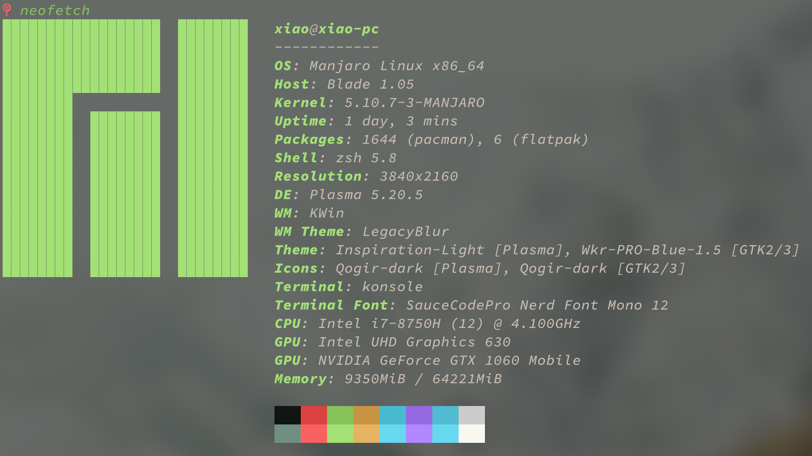

+++
title = "备忘录"
description = "记录一些没那么重要的东西"
draft = false
[taxonomies]
tags = ["Linux", "备忘"]
[extra]
feature_image = "overview.png"
feature = true
link = ""
+++



乱七八糟的东西，随便记一点，可能没什么条理。
******

## Manjaro

基本就是正常安装，桌面选择的是`KDE`（或者用社区打包的开箱即用的i3），文件系统目前选择的是`XFS`。

### 字体

安装字体`nerd-font`，完整版的比较大，差不多2G大小
中文字体首选应该是思源字体，只选中文`adobe-source-han-sans-cn-fonts`即可，或者可以安装cjk全集，包含繁中、简中、日韩字体，略大一点，或者安装Google的`noto-fonts-cjk`，其实这两个应该是一个东西不同贴牌，毕竟共同开发。

安装emoji字体，安装了nerd字体包之后，应该unicode对应的图都能显示出来了，不过显示在终端上是只是单纯的图标字符，在github上看到的很多使用item2的基本都是显示彩色的emoji,在windows下使用`windows terminal`的时候，也是预设好的，会显示平时聊天中的那种emoji。`konsole`就不行了，需要动手配置下`～/.config/fontconfig/fonts.conf`,首先安装下emoji字体`ttf-joypixels`或者`noto-font-emoji`，然后更改下配置文件,在对应位置修改添加：

```xml
<match target="pattern">
<test qual="any" name="family"><string>monospace</string></test>
<edit name="family" mode="assign" binding="same"><string>Iosevka Custom</string></edit>
<edit name="family" mode="append" binding="weak"><string>Symbols Nerd Font</string></edit>
<edit name="family" mode="append" binding="weak"><string>JoyPixels</string></edit>
</match>
<match target="pattern">
<test qual="any" name="family"><string>serif</string></test>
<edit name="family" mode="assign" binding="same"><string>Belgrano</string></edit>
<edit name="family" mode="append" binding="weak"><string>Symbols Nerd Font</string></edit>
<edit name="family" mode="append" binding="weak"><string>JoyPixels</string></edit>
</match>
<match target="pattern">
<test qual="any" name="family"><string>sans-serif</string></test>
<edit name="family" mode="assign" binding="same"><string>Convergence</string></edit>
<edit name="family" mode="append" binding="weak"><string>Symbols Nerd Font</string></edit>
<edit name="family" mode="append" binding="weak"><string>JoyPixels</string></edit>
</match>
<match target="pattern">
<test qual="any" name="family"><string>emoji</string></test>
<edit name="family" mode="assign" binding="same"><string>JoyPixels</string></edit>
</match>
```

注：

- 这个`font.conf`会影响所有的GTK和QT软件
- KDE Plasma桌面emoji选择面板的快捷 `mete+.` (mete一般是windows键)

### kwin

安装完manjaro其实可以开箱即用了，虽然KDE桌面视觉效果上还可以，但是用起来还是不够方便，不过可以添加`kwin`脚本来实现很多功能：

- [maxmize-to-new-desktop](https://github.com/Aetf/kwin-maxmize-to-new-desktop) :全屏应用自动扩展到新虚拟桌面，比较像osx的最大化
- [Parachute](https://github.com/tcorreabr/Parachute) :遍历虚拟桌面并且可以拖动应用和搜索，效果和win10的虚拟桌面遍历界面类似。
- [Quarter Tiling](https://github.com/Jazqa/kwin-quarter-tiling) :用来做窗口平铺，这个是功能最简单，因为够用我就没有选其他功能更复杂的kwin脚本了。

### Dock

这个在`latte dock`出来之后应该就是最好的选择了，基本没有做额外设置。

### 显卡问题

manjaro自带了`mhwd`和`bumblebee`，能用是能用，不过性能不够好，所以改用比较流行的[`optimus-manager`](https://github.com/Askannz/optimus-manager)，具体注意事项看对应的github仓库就可以了,还可以添加一个状态栏小工具[`optimus-manager-qt`](https://github.com/Shatur95/optimus-manager-qt)

总而言之，双显卡尤其是核显加N卡，在linux下属实是恶心人。

## 网络问题

### proxy

目前使用的方案core是`v2ray`，GUI客户端可选的有不少，比如qt写的`qv2ray`。当前使用的是`v2rayA`，是一个Web GUI客户端，还提供了全局透明代理的功能。

除了使用透明代理，还可以使用[proxychain](https://github.com/rofl0r/proxychains-ng)来代理软件，对应的包应该是`proxychains-ng`，proxychain原理是hook了底层libc.so提供的网络函数，所以对一些使用静态链接的程序或者不使用libc的程序是不起作用的(比如golang程序)，详情见[PROXYCHAINS-NG 原理解析](https://void-shana.moe/linux/proxychains-ng.html)

当然除了`proxychains`也还有别的重定向TCP连接到SOCKS5或者HTTP代理的工具，比如[graftcp](https://github.com/hmgle/graftcp)这种使用`ptrace`来实现的，放一段官方介绍：
> 对比 [tsocks](https://linux.die.net/man/8/tsocks)、[proxychains](http://proxychains.sourceforge.net/) 或 [proxychains-ng](https://github.com/rofl0r/proxychains-ng)，`graftcp` 并不使用 [LD_PRELOAD 技巧](https://stackoverflow.com/questions/426230/what-is-the-ld-preload-trick)来劫持共享库的 connect()、getaddrinfo()
等系列函数达到重定向目的，这种方法只对使用动态链接编译的程序有效，对于静态链接编译出来的程序，例如[默认选项编译的 Go 程序](https://golang.org/cmd/link/)，[proxychains-ng 就无效了](https://github.com/rofl0r/proxychains-ng/issues/199)。`graftcp` 使用 [`ptrace(2)`](https://en.wikipedia.org/wiki/Ptrace) 系统调用跟踪或修改任意指定程序的 connect 信息，对任何程序都有效。

在terminal中使用的时候，为了方便，就把各种协议的proxy都设置了一遍，放在`.zhsrc`文件中了：

```zsh
# [proxy]
PROXY_ENV=('http_proxy' 'ftp_proxy' 'https_proxy' 'rsync_proxy' 'all_proxy' 'HTTP_PROXY' 'HTTPS_PROXY' 'FTP_PROXY' 'RSYNC_PROXY' 'ALL_PROXY')
function assign_proxy() {
    for envar ($PROXY_ENV) {
        export $envar=$1
    }
    for envar ('no_proxy' 'NO_PROXY') {
        export $envar=$2
    }
}

function proxy_on() {
    proxy_value="socks5://127.0.0.1:20170"
    no_proxy_value="localhost,127.0.0.1,LocalAddress,LocalDomain.com"
    assign_proxy $proxy_value $no_proxy_value
    echo "Proxy environment variable set."
}

function proxy_off(){
    for envar ($PROXY_ENV){
        unset $envar
    }
    echo -e "Proxy environment variable removed."
}
```

这样需要的时候直接执行下`proxy_on`,然后就可以愉快玩耍了

### Hosts

现在的宽带是移动的，反正网络很是膈应人，当然对我而言主要是github的体验很差，换了几个dns服务也不太行，估计上游就已经污染了，而直接使用国外的dns服务体验不是很理想，可能最好的还是配合`dnscrypt-proxy`这样的工具使用，只是国内DoH体验差一截罢了。
当然我现在的需求没有那么复杂，还是直接给github相关ip写到hosts里去，
从一些在线查询网站获取一下对应ip,比如`[IPAddress](https://www.ipaddress.com)` ,下面列一下github大概会用到的域名：

```conf
# Github Hosts
140.82.113.4 github.com
140.82.114.10 nodeload.github.com
140.82.113.5 api.github.com
140.82.114.10 codeload.github.com

185.199.108.153 training.github.com
185.199.108.153 assets-cdn.github.com
185.199.108.153 documentcloud.github.com
185.199.108.154 help.github.com
185.199.108.153 githubstatus.com

199.232.69.194 github.global.ssl.fastly.net
199.232.96.133 raw.github.com
199.232.96.133 raw.githubusercontent.com
199.232.96.133 cloud.githubusercontent.com
199.232.96.133 gist.githubusercontent.com
199.232.96.133 camo.githubusercontent.com
199.232.96.133 marketplace-screenshots.githubusercontent.com
199.232.96.133 repository-images.githubusercontent.com
199.232.96.133 user-images.githubusercontent.com
199.232.96.133 desktop.githubusercontent.com

199.232.96.133 avatars.githubusercontent.com
199.232.96.133 avatars0.githubusercontent.com
199.232.96.133 avatars1.githubusercontent.com
199.232.96.133 avatars2.githubusercontent.com
199.232.96.133 avatars3.githubusercontent.com
199.232.96.133 avatars4.githubusercontent.com
199.232.96.133 avatars5.githubusercontent.com
199.232.96.133 avatars6.githubusercontent.com
199.232.96.133 avatars7.githubusercontent.com
199.232.96.133 avatars8.githubusercontent.com
```

添加到`/etc/hosts`文件保存之后，直连github基本没问题，毕竟目前只是污染而已。
配合浏览器里面的`SwitchyOmega`拓展，github页面有显示资源未加载的时候，修改一下hosts文件应该就可以了。
